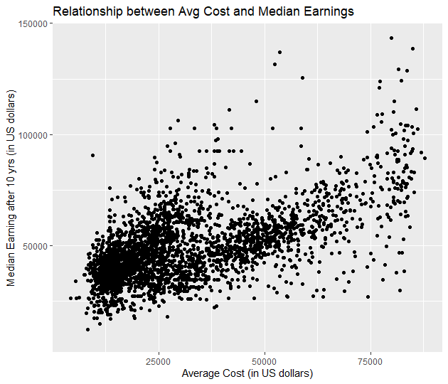

# Project Title: The Return on Investment of a College Degree

## About Dataset: 

This project utilizes a subset of the **College Scorecard Dataset**, a publicly available resource started by the U.S. Department of Education. The raw dataset used in this analysis, college_scorecard_data.csv, is included in this repository for full reproducibility.
The original dataset is quite large and includes many variables with intentionally suppressed data for privacy reasons.
* MD_EARN_WNE_P10: Median earnings of students working and not enrolled 10 years after entry.
* COSTT4_A: Average annual cost of attendance.
A complete **data dictionary** with detailed explanations for all variables can be found here: [College Scorecard Data Dictionary](https://collegescorecard.ed.gov/data/data-documentation)

## Project Description:

This data analysis project investigates the relationship between college costs and graduates’ median earnings 10 years after enrollment. Using the U.S. Department of Education's College Scorecard dataset, I performed a linear regression to model how the average cost of attendance predicts future earnings. The analysis revealed a statistically significant positive relationship, suggesting that higher college costs are associated with higher graduate earnings. However, the model's R^{2} value of 34.4% indicates that other factors significantly influence a graduate's earning potential. Key visualizations include a scatter plot of college cost versus median earnings and a violin plot comparing earnings across different institution types.

## Key Findings and Results:

My analysis of the College Scorecard data revealed a statistically significant relationship between the average cost of a college and the median earnings of its graduates ten years after enrollment.
* **Linear Model:** A linear regression model showed a strong positive association between the two variables. The model's slope indicates that for every $1 increase in average cost of attendance, the median earnings of graduates tend to increase by approximately *$4.59*. The model's low p-value confirms that this relationship is highly significant and not due to random chance.
* **Model Limitations:** While statistically significant, the model's **R-squared value of 0.344** suggests that the average cost of a college explains only about 34.4% of the variation in graduate earnings. This highlights that many other factors contribute to post-graduate income. Diagnostic plots, such as the Q-Q plot, showed that residuals are not perfectly normally distributed and that some outliers exist, which indicates that our model's assumptions have some limitations.
* **Visualizations:** 
    * **Scatter Plot:** The scatter plot visually supports the linear model's findings, showing a **clear positive trend** between college cost and median earnings.
